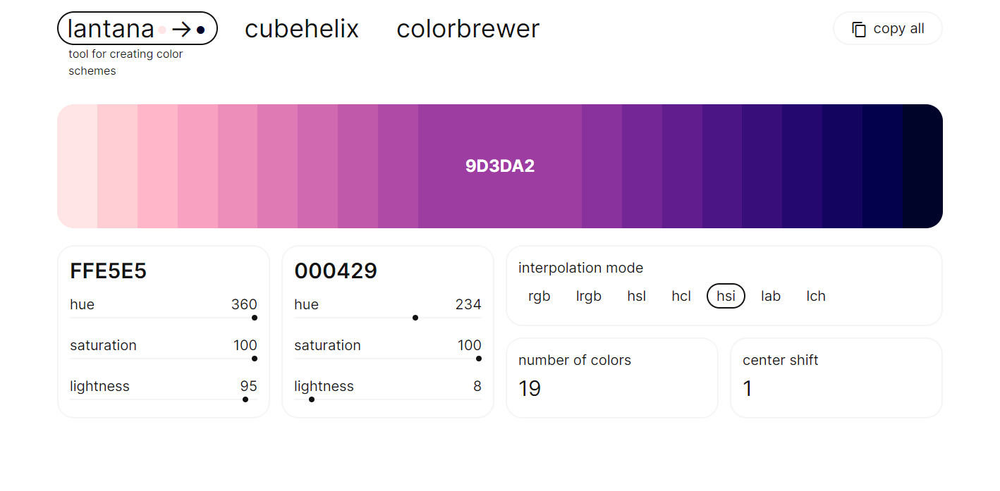
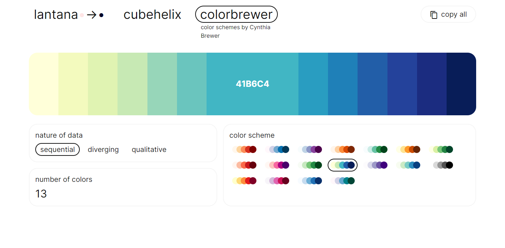

<div align='center'>
    <a href='//dumaevrinat.github.io/lantana'>
        
    </a>

*Tool for creating color schemes.*
</div>

<br>

<p align="center">
    <a href="//dumaevrinat.github.io/lantana">
      
      
    </a>
</p>

## Installation

### Prerequisites
- npm, which you can install by running: 

    ```npm install npm@latest –g```

### How to install
* Clone the repo from this website, then
* In command line:
  * ```$ git clone https://github.com/dumaevrinat/lantana.git```
  * ```$ cd lantana```
  * ```$ npm install```
  * ```$ npm start```

At this point you should see the app running on 

```http://localhost:3000```

## License
All projects and packages in this repository are [MIT licensed](LICENSE).
